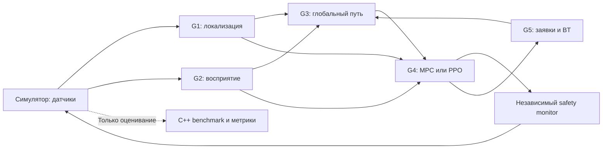

# Автономный складской робот: магистерский командный проект на C++

Сокращения раскрыты при первом употреблении; [полный словарь терминов](docs/GLOSSARY.md).

**5 подпроектов · 2 метода в каждом подпроекте · 25 + 15 = 40 баллов на студента.**

Проект продолжает курс [«Продвинутые автономные мобильные роботы — C++»](https://github.com/Yazan-pyth/advanced_autonomous_mobile_robots_cpp_ru). Это отдельное задание **для магистрантов**, рассчитанное на 14 учебных недель. Его шкала 40 баллов самостоятельная: она не изменяет автоматически процентную шкалу исходного курса.

## Общая задача

Создать автономного дифференциального робота, который выполняет заявки на доставку между станциями небольшого склада: локализуется, обнаруживает препятствия, выбирает маршрут, управляет движением и меняет порядок заявок при задержках. Проверить, когда обучаемые методы полезнее классических, а когда уступают им по надёжности, качеству или вычислительной стоимости.

Общий результат — **один интегрированный робот**, пять сравнительных исследований и воспроизводимый эксперимент. Загрузка и разгрузка моделируются остановкой на станции; манипулятор, реальное оборудование и несколько роботов не обязательны.

## Пять подгрупп

| Группа | Ответственность | Классический метод | DL (Deep Learning — глубокое обучение)/RL (Reinforcement Learning — обучение с подкреплением)-метод |
|---|---|---|---|
| [G1](projects/01_localization.md) | Локализация и геометрическая карта | EKF (Extended Kalman Filter — расширенный фильтр Калмана) + scan-to-map ICP (Iterative Closest Point — итеративный алгоритм ближайших точек для совмещения облаков точек), фиксированная модель шума | Та же схема с MLP (Multilayer Perceptron — многослойный перцептрон) для адаптивной ковариации измерений |
| [G2](projects/02_perception.md) | Восприятие и локальная карта препятствий | Геометрическая обработка RGB-D (Red, Green, Blue and Depth — цветное изображение и карта глубины): плоскость пола, кластеры | Небольшая CNN (Convolutional Neural Network — свёрточная нейронная сеть) сегментации проходимой области |
| [G3](projects/03_planning.md) | Глобальное планирование | A* (A-star — алгоритм поиска пути с оценкой уже пройденной стоимости и эвристикой оставшегося пути) с фиксированной стоимостью проходимости | A* с обученной CNN-картой стоимости |
| [G4](projects/04_control.md) | Локальное управление и независимый safety monitor | Ограниченный MPC (Model Predictive Control — управление с прогнозирующей моделью) | PPO (Proximal Policy Optimization — алгоритм оптимизации политики с ограничением величины её обновления)-политика локального управления |
| [G5](projects/05_mission.md) | Диспетчеризация заявок и общая сборка | Behavior Tree + фиксированное правило выбора заявки | DQN (Deep Q-Network — глубокая нейронная сеть для оценки ценности действий) для выбора следующей заявки внутри того же BT (Behavior Tree — дерево поведения) |

MLP и CNN должны реально обучаться или дообучаться, а не служить переименованной эвристикой. Использование одинакового EKF/A*/BT вокруг модели разрешено: предмет исследования — заменяемая обучаемая часть. G4 изучает RL на уровне движения, G5 — на уровне миссии.



## Обязательные результаты

1. Исходники C++17, CMake/ament, ROS 2 (Robot Operating System 2 — вторая версия программной платформы для робототехники) `rclcpp`, тесты и Git-история с review.
2. Рабочие классический и DL/RL-варианты **каждой** подгруппы с единым интерфейсом и выбором через конфигурацию.
3. Один Docker-контейнер или два: симулятор и автономная система. В этом шаблоне предусмотрены два.
4. Зафиксированные train/validation/test-сценарии, обученные модели с hash и инструкции воспроизведения.
5. Метрики, доверительные интервалы, анализ ошибок и отрицательных результатов, а не только видео или reward.
6. Пять отчётов по 8–12 страниц и один интеграционный отчёт 10–15 страниц, не считая приложений.
7. Общая демонстрация всех пяти компонентов, сравнение систем и проверка отказов.

## Как сдать проект полностью

**Сдача состоит из трёх частей: защита своего подпроекта, общая демонстрация робота и индивидуальные ответы каждого студента.** Пять отдельных работающих программ ещё не являются сдачей интегрированного проекта. Запуск стартовой проверки `/clock` подтверждает только работу инфраструктуры.

1. **Зафиксировать результат в Git.** Передать преподавателю ссылку на репозиторий, тег сдачи и точный коммит. В этой версии должны быть исходники обоих методов каждой группы, конфигурации, тесты, инструкции запуска и ссылки на модели/данные с контрольными суммами.
2. **Подготовить воспроизведение.** Из чистой копии репозитория преподаватель должен собрать контейнеры, запустить любой метод, выбранный сценарий и расчёт итоговых таблиц. В инструкции указать точные команды, требования к компьютеру, длительность и ожидаемые выходные файлы. Команды запуска итоговой системы пишут студенты: команды в конце этого README пока запускают только стартовую проверку.
3. **Сдать результаты экспериментов.** Пять отчётов по 8–12 страниц и общий отчёт 10–15 страниц; исходные журналы, таблицы результатов, графики, доверительные интервалы, модели и описание обучающих/проверочных/тестовых данных. Для каждого запуска сохранить настройки, начальное число генератора случайных чисел (`seed`), версии кода, мира и модели.
4. **Защитить пять подпроектов.** Каждая группа запускает классический и обучаемый методы на одном выбранном тестовом случае, показывает различия по метрикам и объясняет ошибки. Преподаватель может выбрать случай из сданного набора, а не только подготовленное студентами красивое видео.
5. **Защитить общую систему.** Весь робот выполняет миссию в классической и полностью обучаемой конфигурациях; команда показывает перепланирование или работу с движущимся препятствием, безопасную реакцию на отказ и повторный запуск после сброса симулятора.
6. **Подтвердить личный вклад.** Каждый студент показывает свою реализацию, проверку или эксперимент, объясняет оба метода своей группы и одну задачу интеграции. Ссылки на изменения и взаимные проверки кода — в [индивидуальной записи вклада](templates/CONTRIBUTION.md).

**Оценка каждого студента — до 40 баллов: 25 за подпроект и 15 за интеграцию.** Выполнение списка означает полноту сдачи, но не автоматические 40 баллов. Числовой порог зачёта и перевод баллов в оценку дисциплины преподаватель объявляет до начала работы; в этом задании такой порог пока не установлен. Неполные результаты оцениваются по [рубрике](docs/GRADING.md), а не по новым скрытым требованиям.

Обучаемый метод **не обязан победить** классический. Неудачные эпизоды необходимо сохранить и объяснить. Однако постоянный переход обучаемой конфигурации на классический резервный метод не доказывает, что обучаемая часть работает: преподаватель проверяет её реальные выходы и долю таких переключений.

## Что преподаватель проверяет в каждом подпроекте — 25 баллов

| Проверка | Баллы | Что группа предъявляет |
|---|---:|---|
| Постановка и интерфейсы | 3 | Исследовательский вопрос, математические модели, входы/выходы, ограничения, связь с курсом |
| Классический метод | 5 | Работающую реализацию на C++, собственный алгоритмический вклад, тесты обычных и граничных случаев |
| Обучаемый метод | 5 | Код обучения, сохранённую модель, независимые тестовые данные, выполнение модели на C++, обработку некорректного результата |
| Сравнение и анализ | 6 | Одинаковые условия A/B, обязательные сценарии, метрики и доверительные интервалы, исследование с отключением одного элемента метода, минимум 3 разобранных случая ошибки |
| Код, Git и Docker | 3 | Сборку из чистой копии, тесты, историю изменений и проверки кода, воспроизводимые команды |
| Отчёт и личная защита | 3 | 1 балл за общий отчёт группы и до 2 за личное объяснение методов и своего вклада |
| **Всего** | **25** | |

Программная часть робота, выполнение моделей и расчёт метрик должны быть на C++. Python разрешён только для подготовки данных и обучения вне исполняемого контура робота. Преподаватель проверяет, что эталонное положение робота и разметка симулятора не поступают в алгоритмы во время тестовой навигации.

### Предметные проверки пяти групп

Все случаи в столбце «Обязательные случаи» входят в проверку соответствующей группы. Для обычных сравнительных сценариев требуется **не менее 20 тестовых эпизодов на случай для каждого метода**. Короткие проверки некорректного сообщения или отсутствующего входа дополнительно оформляются как автоматические тесты; они не заменяют сравнительные эпизоды. Полные определения метрик и артефактов находятся в заданиях групп.

| Группа | Обязательные случаи | Что преподаватель смотрит в результатах |
|---|---|---|
| [G1: локализация](projects/01_localization.md) | Обычное движение; проскальзывание колёс; коридор с бедной геометрией; пропадание инерциальных измерений; пропадание лазерных измерений | Ошибку положения и ориентации относительно эталона, согласованность ковариации, потерю и восстановление локализации, задержки; корректность общей карты и преобразований координат |
| [G2: восприятие](projects/02_perception.md) | Обычное освещение; слабое освещение; тонкое препятствие; участки с отсутствующей глубиной | Качество выделения препятствий и свободной области, опасные ошибки «препятствие принято за свободное место», корректность проекции на карту, задержки и память |
| [G3: планирование](projects/03_planning.md) | Узкий проходимый коридор; перекрытый проход с объездом; выбор между коротким загруженным и длинным свободным маршрутом | Наличие допустимого пути, отсутствие прохода через препятствия, длину и запас расстояния, время планирования, перепланирования и фактические задержки доставки; недостижимая цель — отдельный тест явного отказа |
| [G4: управление](projects/04_control.md) | Прямой путь; кривой путь; движущееся препятствие; отклонение параметров модели на −20% и +20%; задержанные измерения/команды | Ошибку следования, столкновения, ограничения скорости и ускорения, плавность команд, время вычисления; вмешательства независимого защитного узла и безопасную остановку |
| [G5: миссии](projects/05_mission.md) | Низкая и высокая интенсивность заявок; общий узкий участок маршрутов; перекрытый маршрут; разные сроки доставки | Количество и своевременность доставок, незавершённые заявки, время ожидания, правильный порядок загрузки/разгрузки, ограниченное число попыток восстановления; пустая очередь и запрещённое действие — отдельные тесты |

Для G4 оба знака отклонения модели должны быть представлены в 20 эпизодах этого случая, например 10 + 10; параметры задержек фиксируются до тестирования. Для G5 низкая и высокая интенсивности — два отдельных случая. G1–G3 обучают как минимум одну версию модели; G4 и G5 проводят обучение с **тремя независимыми начальными числами генератора**, и результаты всех трёх показывают при изолированной оценке. Выбор модели для общей системы выполняется по проверочным, а не итоговым тестовым данным.

## Какие сценарии нужны для всего робота

Один эпизод — миссия длительностью до **300 секунд времени симуляции**. Начальные положения, заявки, препятствия и настройки сохраняются в описании запуска. Базовый набор: **6 заявок** с моментами появления `[0, 20, 50, 80, 120, 160]` секунд и сроком доставки через 120 секунд после появления. Вместимость робота — одна заявка; загрузка/разгрузка — остановка на станции на 2 секунды. Подробности и допустимая предварительная настройка нагрузки — в [постановке](docs/PROJECT.md).

Для каждого семейства ниже нужны **20 эпизодов: по 10 на каждой из двух тестовых планировок склада**. Одни и те же описания эпизодов используются для всех семи конфигураций системы. Итоговые тестовые планировки и журналы нельзя использовать для обучения моделей или подбора параметров.

| Сценарий | Что обязательно создать | Что проверяется |
|---|---|---|
| **S1 — обычный статический склад** | Стеллажи и проходимые маршруты между станциями; без движущихся объектов и дополнительных отказов. Датчики имеют зафиксированный штатный шум | Полный цикл «получить заявку → подъехать → загрузиться → доставить → разгрузиться», точность и устойчивость навигации |
| **S2 — пересечение с движущимся препятствием** | Как минимум один движущийся объект пересекает рабочий маршрут робота. Траектория, скорость и момент старта задаются в описании эпизода. До фиксации тестов проверить, что сцена действительно создаёт встречу, а не движение объекта далеко от робота | Обнаружение объекта, снижение скорости или остановка/объезд, отсутствие столкновения, влияние ожидания на доставки |
| **S3 — перекрытие прохода и перепланирование** | После начала движения закрыть проход, использовавшийся начальным маршрутом; альтернативный проходимый путь должен существовать. Момент и место перекрытия фиксируются заранее. В этом семействе не добавлять движущиеся объекты | Обновление карты препятствий, отказ от устаревшего пути, построение объезда и продолжение заявки. Отдельный тест полностью недостижимой цели не заменяет этот сценарий |
| **S4 — ухудшение измерений и модели движения** | 10 эпизодов с проскальзыванием/отклонением модели движения и 10 с повышенным шумом или пропусками глубины; на каждой планировке по 5 каждого типа. Пределы возмущений, знаки отклонения и интервалы воздействия зафиксировать заранее | Устойчивость локализации, восприятия и управления, падение качества относительно S1, работа резервного режима. Полное отключение датчика относится к отдельным испытаниям отказов |

Геометрия склада, скорости объектов, величины шума и моменты воздействий выбираются командой на этапе проверки сценариев, фиксируются до итоговых запусков и остаются одинаковыми при сравнении методов. Прохождение сценария означает выполнение миссии с корректным журналированием результата; **не требуется скрывать или исключать столкновения и неуспехи из статистики**. Обнаруженный проигрыш метода должен быть отражён в анализе.

### Какие конфигурации сравнивать

Здесь **A — классический метод**, **B — обучаемый метод**, **C — Configuration (конфигурация системы)**. Одна буква относится к одному компоненту, а не ко всей команде.

| Конфигурация | G1 | G2 | G3 | G4 | G5 |
|---|---|---|---|---|---|
| C0: все классические | A | A | A | A | A |
| C1: обучаемая локализация | B | A | A | A | A |
| C2: обучаемое восприятие | A | B | A | A | A |
| C3: обучаемая стоимость пути | A | A | B | A | A |
| C4: обучаемое управление | A | A | A | B | A |
| C5: обучаемая диспетчеризация | A | A | A | A | B |
| C6: все обучаемые | B | B | B | B | B |

Обязательный объём общей сравнительной серии: **7 конфигураций × 4 семейства × 20 эпизодов = 560 запусков**. Они выполняются заранее; на защите не нужно ждать завершения всех 560. Изолированные эксперименты групп и испытания отказов в это число не входят. Общие эпизоды C1…C5 можно использовать как сравнение с заменой одного компонента, если остальные условия совпадают с протоколом.

В общей таблице показать долю успешных миссий, столкновения и завершения по лимиту времени, число доставок и долю доставок в срок, пройденное расстояние, минимальный зазор до препятствий, задержки вычислений и число защитных вмешательств. Для каждого показателя указать число эпизодов и доверительный интервал, где применимо. Ошибки запуска и аварийные завершения не удалять. Формулы и правила агрегации — в [протоколе экспериментов](docs/EXPERIMENTS.md).

### Обязательные испытания отказов

Это отдельная серия: **5 видов отказа × 5 повторов × 2 конфигурации (C0 и C6) = минимум 50 испытаний**. Для каждого сохранить момент воздействия, ожидаемую реакцию, фактическую задержку обнаружения/остановки, причину отказа и результат восстановления. Отказы не смешиваются со статистикой обычных миссий.

| Отказ | Как воспроизвести | Что преподаватель проверяет |
|---|---|---|
| Пропадание датчика | Во время движения прекратить публикацию лазерных измерений дольше допустимого возраста данных | Защитная остановка; движение возобновляется только после свежих данных и проверки готовности |
| Устаревшая команда | Контроллер остаётся запущенным, но перестаёт выдавать новые команды либо выдаёт старую временную метку | Сторожевой контроль отвергает команду; робот не продолжает бесконечно выполнять последнее ненулевое управление |
| Повреждённая или отсутствующая модель | До активации заменить файл одной обучаемой модели повреждённым или убрать его; компонент и файл указать в описании испытания | В C6 — явная диагностика и разрешённый классический резервный режим либо запрет запуска; в C0 — подтверждение, что неиспользуемая модель не требуется. Это проверка загрузки, а не успешности миссии |
| Завершение процесса | Принудительно завершить процесс локального контроллера во время движения | Независимый защитный узел/драйвер останавливает робота; управляющий процесс не является единственным средством защиты |
| Остановка времени симуляции | Остановить продвижение `/clock` при активной миссии | Контроль по реальному монотонному времени продолжает работать, выдаётся безопасная команда и ошибка; зависшее время симуляции не блокирует защиту |

Пределы возраста данных и команд, требования к резервным режимам и повторному запуску заданы в [контрактах безопасности](docs/INTERFACES.md). Ошибка модели и отключение датчика не должны приводить к молчаливой выдаче некорректной команды.

**Необязательные расширения:** несколько роботов, физический робот, манипулятор, другой симулятор, дополнительная смешанная конфигурация C7, все 32 комбинации методов и отдельные новые условия за пределами обучающего распределения. Они не заменяют S1–S4, пять испытаний отказов и сравнение C0–C6.

## Что преподаватель проверяет в общем проекте — 15 баллов

| Проверка | Баллы | Что показывают все группы вместе |
|---|---:|---|
| Работа всех пяти компонентов | 4 | Миссию от получения заявки до доставки в C0 и C6; реальные входы/выходы каждого компонента |
| Запуск и согласованность интерфейсов | 3 | Сборку и запуск Docker, корректные координаты и время сообщений, отмену задач, проверку готовности и повторный запуск после сброса |
| Системное сравнение и отчёт | 3 | Полноту 560 запусков, исходные результаты и итоговые таблицы; объяснение, почему улучшение отдельного компонента помогло или не помогло всему роботу |
| Безопасность и восстановление | 2 | Независимый защитный узел, сторожевой контроль драйвера и журналы минимум 50 испытаний отказов |
| Личный вклад в интеграцию | 3 | Для каждого студента: межгрупповой интерфейс/тест, проверку или исправление интеграционной ошибки, личную демонстрацию диагностики |
| **Всего** | **15** | Первые 12 баллов общие, последние 3 индивидуальные |

### Порядок демонстрации на защите

1. Открыть сданный тег и показать команды сборки/запуска, наличие моделей и результатов автоматических проверок.
2. Показать для каждой группы оба метода на одном тестовом входе и одну таблицу сравнений; преподаватель задаёт каждому студенту вопросы о моделях, параметрах и ошибках.
3. Запустить миссию S1 в C0 и C6. Показать не только движение, но и переходы заявок, доставленные/недоставленные заявки и активность всех пяти компонентов.
4. Повторить выбранный преподавателем эпизод S2, S3 или S4 из сданного набора и объяснить поведение системы.
5. Воспроизвести один выбранный отказ, показать защитную реакцию, восстановление и сброс. Журналы остальных обязательных отказов предъявляются из заранее выполненной серии.
6. Пересчитать одну итоговую таблицу из исходных журналов, сопоставить её с отчётом и показать записи личного вклада.

Полную серию экспериментов преподаватель проверяет по журналам и выборочному повторению. Видео может дополнять защиту, но не заменяет исходники, запуск и измерения. Отсутствие одного метода, неполная интеграция и утечка тестовых данных оцениваются по правилам [GRADING.md](docs/GRADING.md); новых штрафов этот список не вводит.

## Как работать с заданием

- [Постановка, ограничения и связь с курсом](docs/PROJECT.md)
- [ROS 2 интерфейсы, временные бюджеты и безопасность](docs/INTERFACES.md)
- [Эксперименты, метрики и статистика](docs/EXPERIMENTS.md)
- [Критерии оценивания: 25 + 15](docs/GRADING.md)
- [Команда, Git, план на 14 недель](docs/WORKFLOW.md)
- [Docker и границы стартового кода](docs/DEVELOPMENT.md)
- [Первоначальная настройка репозитория на GitHub](docs/GITHUB_SETUP.md) — для владельца репозитория
- [Шаблон отчёта](templates/REPORT.md), [модель](templates/MODEL_CARD.md), [вклад студента](templates/CONTRIBUTION.md)
- [Технические первоисточники](docs/REFERENCES.md)

## Статус репозитория

Это **задание и стартовая инфраструктура**, а не готовое решение студентов. В комплект входят описания пяти проектов, контракты ROS 2, экспериментальный план, рубрика, C++-проверка `/clock`, мир склада Webots с роботом TIAGo Base и управлением через `/cmd_vel`, пустые заготовки пакетов всех групп, команды `make` и CI (Continuous Integration — непрерывная интеграция; автоматическая сборка и проверки) для двух контейнеров. Алгоритмы, модель робота, датчики, складские сценарии, benchmark и обученные модели должны быть разработаны студентами. Успешная проверка `/clock` не означает готовность автономной навигации.

Базовый стек: Ubuntu 24.04 в контейнерах (на компьютере достаточно Ubuntu 22.04 или 24.04 с Docker), ROS 2 Jazzy, Webots R2025a ([решение команды](docs/adr/0001-webots-simulator.md)), C++17, Eigen/OpenCV (Open Source Computer Vision Library — открытая библиотека компьютерного зрения), ONNX (Open Neural Network Exchange — открытый формат обмена моделями нейронных сетей) Runtime или LibTorch. Допускается другой симулятор при сохранении общих интерфейсов и benchmark. Вся группа использует один выбранный симулятор. Python допускается **только offline** для подготовки данных и обучения, как в исходном курсе; исполнение робота, inference, runner и расчёт метрик — C++.

## Быстрый старт

Нужен компьютер с Ubuntu 22.04 или 24.04 (x86_64) и примерно 20 ГБ свободного места. Всё остальное, включая ROS 2 Jazzy и Webots, работает в Docker, поэтому окружение у всех одинаковое.

**1. Один раз: git, клонирование и подготовка компьютера.** Скрипт ставит `make` и Docker Engine (через [get.docker.com](https://get.docker.com)), добавляет вас в группу `docker` и сразу запускает `make setup`. Уже установленное он не трогает.

```bash
sudo apt install -y git
git clone git@github.com:<организация>/<репозиторий>.git
cd <репозиторий>
./scripts/setup_host.sh
```

В конце должно появиться `ГОТОВО: окружение работает`. Если скрипт добавил вас в группу `docker`, перезайдите в систему: без этого новые терминалы не получат доступ к Docker.

**2. Каждый день.** Код редактируется в любом редакторе прямо в папке репозитория, а собирается и запускается в контейнере:

| Команда | Что делает |
|---|---|
| `make build PKG=capstone_perception` | собрать свой пакет; повторная сборка занимает секунды |
| `make test PKG=capstone_perception` | тесты своего пакета |
| `make shell` | терминал в контейнере: `ros2 topic list`, `ros2 run ...` |
| `make sim` / `make sim-gui` | симулятор без окна / сцена в окне Webots |
| `make smoke` | проверка как в CI: сцена Webots загружается, `/clock` доходит до второго контейнера |
| `make doctor` | проверить компьютер и получить подсказку, что исправить |
| `make` | список всех команд |

Новая библиотека подключается строкой `<depend>...</depend>` в `package.xml` пакета: следующий `make build` сам пересоберёт образ. Работа с ветками и PR (Pull Request — запрос на включение изменений в репозиторий) описана в [WORKFLOW.md](docs/WORKFLOW.md), устройство контейнеров — в [DEVELOPMENT.md](docs/DEVELOPMENT.md).

`make smoke` проходит, только если Webots загрузил сцену без строк `ERROR:` и `/clock` продвигается. Ошибка в мире (неизвестный узел, ненайденный PROTO или текстура) завершает симулятор с кодом 1 и сообщением `FAIL: simulation did not start cleanly`; отсутствие `/clock` даёт ошибку по wall-clock timeout.
